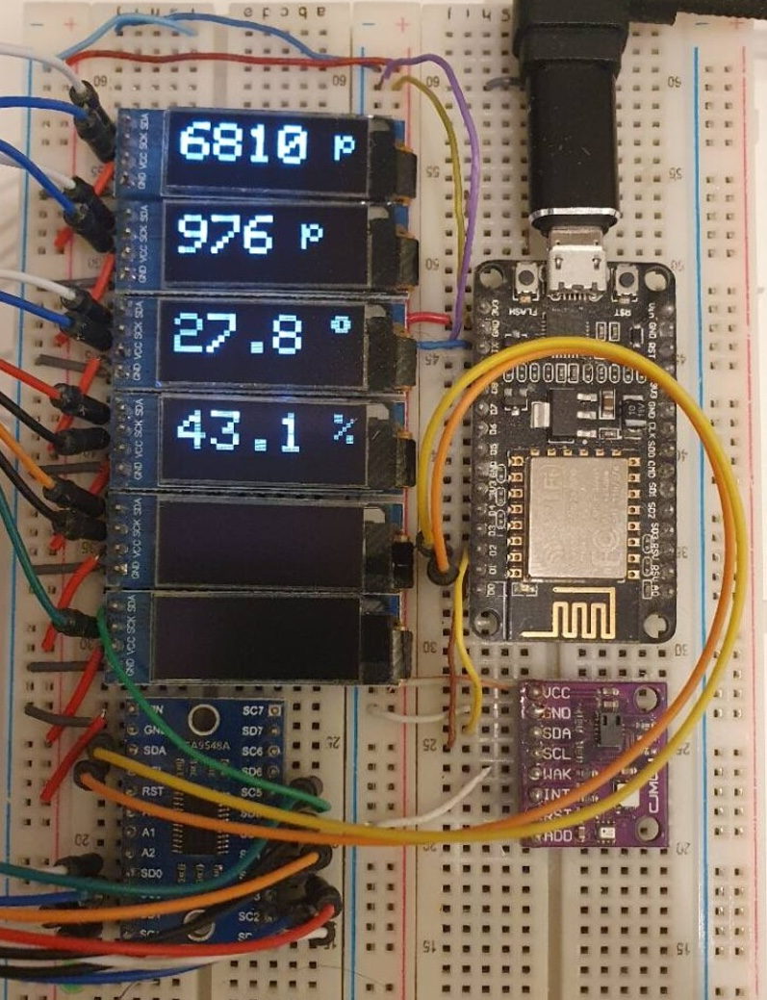

# ESP Dashboard

ESP Dashboard is a PlatformIO/Arduino firmware project for an ESP8266 NodeMCU v2. It drives six small SSD1306 OLED displays through a TCA9548 I2C multiplexer, fetches prayer times over Wi-Fi, and alternates them with indoor air-quality and climate readings.



## Features

- Displays one value per OLED across six 128x32 SSD1306 displays
- Reads eCO2 and TVOC from a CCS811 sensor
- Reads temperature and humidity from a Si7021 sensor
- Feeds Si7021 temperature/humidity data back into the CCS811 for environmental compensation

## Hardware

- ESP8266 NodeMCU v2
- TCA9548 I2C multiplexer at address `0x70`
- Up to six SSD1306 OLED displays at address `0x3C`
- CCS811 air-quality sensor
- Si7021 temperature/humidity sensor

Default ESP8266 I2C wiring:

| Signal | NodeMCU Pin |
| ------ | ----------- |
| SDA | D2 |
| SCL | D1 |
| CCS811 nWAKE | D3 |
| VDD | 3V3 |
| GND | GND |

## Project Structure

```text
src/
  main.cpp            Main firmware loop, Wi-Fi setup, HTTP fetch, display cycle
  display.*           SSD1306 display setup and rendering helpers
  i2c_mux.*           TCA9548 channel selection and scan helper
  ccs811_utils.*      CCS811 setup and readings
  si7021.*            Si7021 setup and readings
  regex_matcher.*     HTML parsing helpers for prayer times
  config_template.h   Wi-Fi configuration template
platformio.ini        PlatformIO environment and library dependencies
```

## Setup

1. Install [PlatformIO](https://platformio.org/).

2. Create your local Wi-Fi config:

   ```sh
   cp src/config_template.h src/config.h
   ```

3. Copy the config template `src/config_template.h` to `src/config.h` and add your Wifi credentials:

   ```cpp
   #define WIFI_SSID "Your network name"
   #define WIFI_PASSWORD "Your network password"
   ```

4. If needed, adjust the serial device in `platformio.ini`:

   ```ini
   upload_port = /dev/cu.SLAB_USBtoUART
   monitor_port = /dev/cu.SLAB_USBtoUART
   ```

## Build and Upload

Build the firmware:

```sh
pio run
```

Upload to the connected NodeMCU:

```sh
pio run --target upload
```

Open the serial monitor:

```sh
pio device monitor
```

The monitor is configured for `115200` baud and uses the ESP8266 exception decoder filter.

## Runtime Behavior

On boot, the firmware initializes the regex parser, display bus, CCS811, Si7021, and Wi-Fi station mode. The main loop:

1. Fetches prayer-time HTML over HTTP.
2. Parses prayer names and `HH:MM` values.
3. Shows the parsed times across the OLED displays for 10 seconds.
4. Reads CCS811, Si7021 temperature, and Si7021 humidity values.
5. Shows sensor values across the OLED displays for 10 seconds.

If the HTTP request fails, the display shows `Loading...` while retrying.

## Notes

- The project currently uses a plain HTTP endpoint, not HTTPS.
- The prayer-time parser depends on the current HTML shape of the source page.
- `NUM_DISPLAYS` is set to `6` in `src/display.h`.
- The configured PlatformIO environment is `nodemcuv2`.
